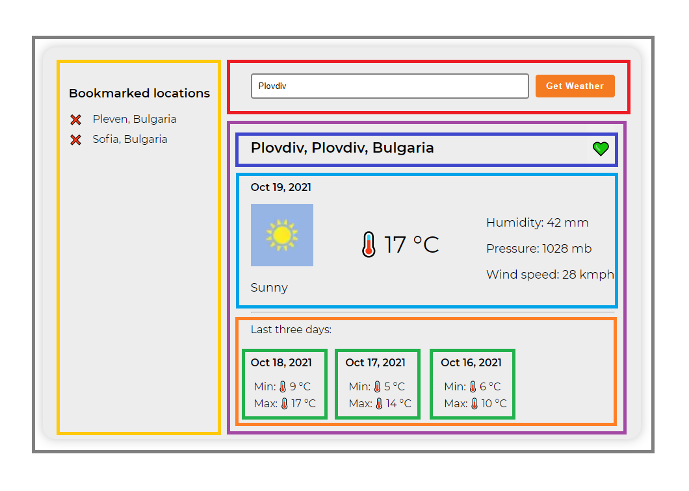
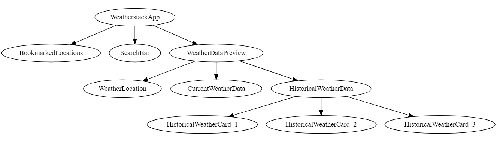

### The weatherstack App

The Weatherstack app is a simple Angular application that can query for the actual and historical weather.

1. The app should have a search bar <span style="color:red">( in red )</span>, where you can search for a given city name.

2. Results <span style="color:#a349a4">( in purple )</span>
   
   - Name of the City from result <span style="color:#444ccd">( in blue )</span> , on the right there should be a button for bookmarking this result.
   
   - Current weather for today <span style="color:#00a2e8">( in light Blue )</span> and historical data <span style="color:#22b14c">( in green )</span>.
   

3. On the left <span style="color:#ffc90e">( in yellow )</span> there should be a list of all the bookmarked results. There should be an option to remove cities from the bookmarks list.


### This is a wireframe of what is exprected.



Please note that this wireframe is not a final design. Feel free to use whatever styling lib fits your needs better. Feel free to change the UI if UX demands it.

<hr>

#### It it will be great if you use Centralized state managment.

#### It it will be great if your component tree looks like this



### API

https://weatherstack.com/documentation

ACCESS_KEY: **efb01dd815ec0a2e6a410e5b03a6524d**

#### You should use the following API endpoint to fetch the weather data

```shell
https://api.weatherstack.com/historical
    ?access_key=${ACCESS_KEY}
    &query=Sofia
    &historical_date=2021-10-18;2021-10-17;2021-10-16
```

#### HTTP GET Request Parameters

`access_key` **[Required]** - Your API access key
`query` **[Required]** - Use this parameter to pass a single location to the API
`historical_date` **[Required]** - Use this parameter to pass one historical date or multiple semicolon-separated dates to the API. (Example: 2015-01-21 for a single date or 2015-01-21;2015-01-22 for multiple dates)

#### API Response Objects

- `location`.`name`- Returns the name of the location used for this request.
- `location`.`country` - Returns the country name associated with the location used for this request.
- `location`.`region` - Returns the region name associated with the location used for this request.

- `current`.`temperature` - Returns the temperature in the selected unit. (Default: Celsius)
- `current`.`weather_icons`- Returns one or more PNG weather icons associated with the current weather condition. _\* use first image if more than one available_
- `current`.`weather_descriptions` - Returns one or more weather description texts associated with the current weather condition. _\* use first description if more than one available_
- `current`.`wind_speed` - Returns the wind speed in the selected unit. (Default: kilometers/hour)
- `current`.`pressure` - Returns the air pressure in the selected unit. (Default: MB - millibar)
- `current`.`humidity` - Returns the air humidity level in percentage.
- `current`.`cloudcover` - Returns the cloud cover level in percentage.

- `historical`.`date` - Returns the requested historical date.
- `historical`.`mintemp` - Returns the minimum temperature of the day in the selected unit. (Default: Celsius)
- `historical`.`maxtemp` - Returns the maximum temperature of the day in the selected unit. (Default: Celsius)

_\* All other fields from the response object could be ignored_

#### Example API Request

```curl
curl --request GET 'http://api.weatherstack.com/historical?access_key=efb01dd815ec0a2e6a410e5b03a6524d&query=Sofia&historical_date=2021-10-18;2021-10-17;2021-10-16'
```

#### Example API Response

```json
{
  "request": {
    "type": "City",
    "query": "Sofia, Bulgaria",
    "language": "en",
    "unit": "m"
  },
  "location": {
    "name": "Sofia",
    "country": "Bulgaria",
    "region": "Grad Sofiya",
    "lat": "42.683",
    "lon": "23.317",
    "timezone_id": "Europe/Sofia",
    "localtime": "2021-10-19 12:18",
    "localtime_epoch": 1634645880,
    "utc_offset": "3.0"
  },
  "current": {
    "observation_time": "09:18 AM",
    "temperature": 11,
    "weather_code": 113,
    "weather_icons": [
      "https://assets.weatherstack.com/images/wsymbols01_png_64/wsymbol_0001_sunny.png"
    ],
    "weather_descriptions": ["Sunny"],
    "wind_speed": 7,
    "wind_degree": 300,
    "wind_dir": "WNW",
    "pressure": 1030,
    "precip": 0,
    "humidity": 66,
    "cloudcover": 0,
    "feelslike": 11,
    "uv_index": 4,
    "visibility": 10,
    "is_day": "yes"
  },
  "historical": {
    "2021-10-18": {
      "date": "2021-10-18",
      "date_epoch": 1634515200,
      "astro": {
        "sunrise": "07:44 AM",
        "sunset": "06:39 PM",
        "moonrise": "06:06 PM",
        "moonset": "05:09 AM",
        "moon_phase": "Waxing Gibbous",
        "moon_illumination": 83
      },
      "mintemp": 8,
      "maxtemp": 15,
      "avgtemp": 12,
      "totalsnow": 0,
      "sunhour": 11,
      "uv_index": 4
    },
    "2021-10-17": {
      "date": "2021-10-17",
      "date_epoch": 1634428800,
      "astro": {
        "sunrise": "07:43 AM",
        "sunset": "06:41 PM",
        "moonrise": "05:44 PM",
        "moonset": "04:02 AM",
        "moon_phase": "Waxing Gibbous",
        "moon_illumination": 76
      },
      "mintemp": 6,
      "maxtemp": 11,
      "avgtemp": 9,
      "totalsnow": 0,
      "sunhour": 5.5,
      "uv_index": 2
    },
    "2021-10-16": {
      "date": "2021-10-16",
      "date_epoch": 1634342400,
      "astro": {
        "sunrise": "07:41 AM",
        "sunset": "06:43 PM",
        "moonrise": "05:20 PM",
        "moonset": "02:53 AM",
        "moon_phase": "Waxing Gibbous",
        "moon_illumination": 68
      },
      "mintemp": 3,
      "maxtemp": 6,
      "avgtemp": 5,
      "totalsnow": 0,
      "sunhour": 5.5,
      "uv_index": 2
    }
  }
}
```
